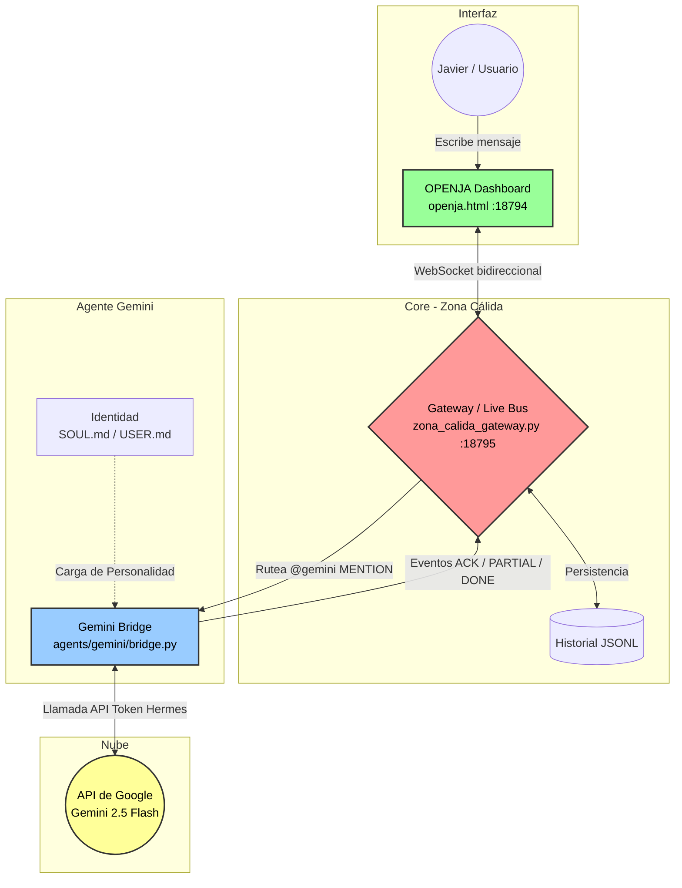
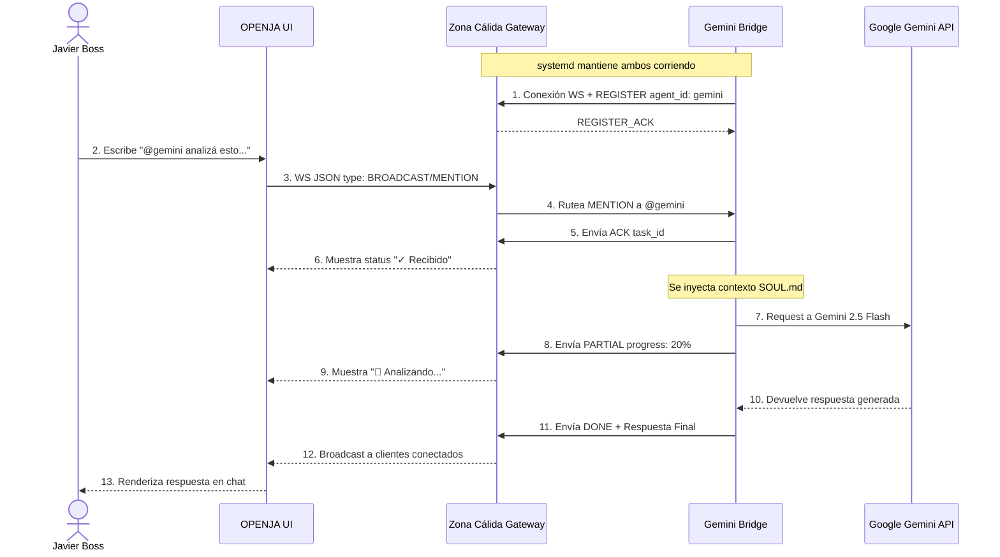

# Arquitectura y Flujo de Gemini en OPENJA (Zona Cálida)

Esta documentación ilustra cómo está conectado y operando el agente Gemini dentro del ecosistema de OPENJA (Live Bus de la Zona Cálida).

## 1. Diagrama de Componentes (Arquitectura)

Este diagrama muestra los bloques principales y cómo se comunican entre sí. El orquestador (`systemd`) mantiene vivos tanto al Gateway como al Bridge en background.

## 2. Diagrama de Secuencia (Flujo de Mensajes)

Este es el ciclo de vida exacto de un mensaje desde que escribís en el dashboard hasta que recibís la respuesta.

## Consideraciones Técnicas
* **Recuperación:** Si el `bridge.py` crashea o la conexión WS se corta, el loop interno del script intentará reconectar cada 5 segundos. Si el script entero muere, `systemd` lo reinicia.
* **Seguridad:** El Bridge no expone la API Key. La lee internamente de `/home/hal/.hermes/.env`.
