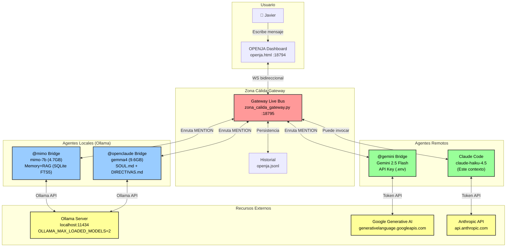
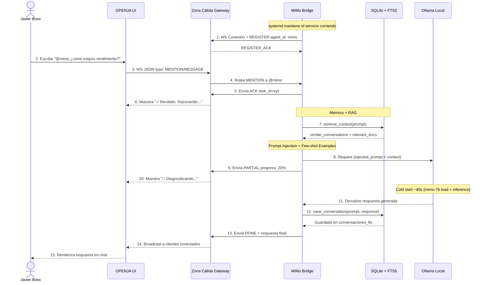
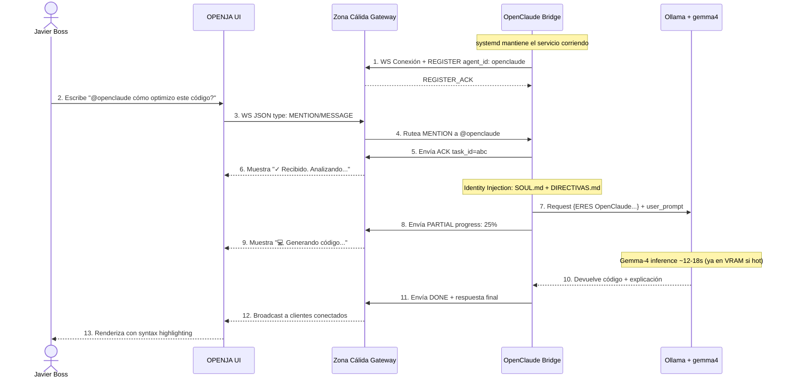
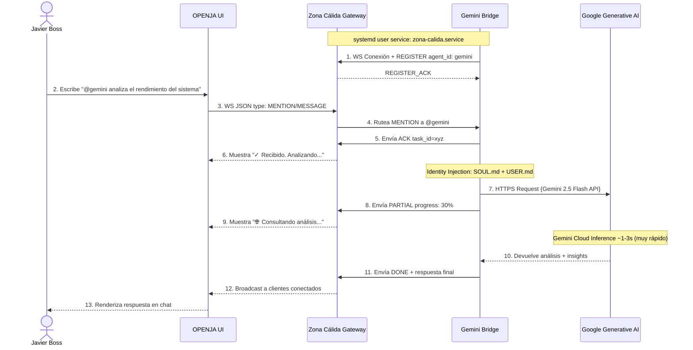

# OPENJA Local Agents Architecture
## MiMo-7B, OpenClaude, Gemini, Claude Code en Zona Cálida

**Fecha:** 2026-05-02  
**Autores:** Javier Guerrero, Claude (Anthropic)  
**Status:** OPERATIONAL  
**Última actualización:** 2026-05-02

---

## 1. Overview & Architecture Components

OPENJA integra cuatro agentes: tres locales (Ollama) + uno remoto (Anthropic API):

| Agente | Modelo | Especialidad | Infraestructura |
|--------|--------|--------------|-----------------|
| **@mimo** | mimo-7b (4.7GB) | Razonamiento profundo, investigación | Ollama + SQLite FTS5 Memory+RAG |
| **@openclaude** | gemma4 (9.6GB) | Código, arquitectura técnica | Ollama + SOUL.md/DIRECTIVAS.md |
| **@gemini** | gemini-2.5-flash (API) | Análisis general, escritura rápida | Google Cloud + API Key |
| **Claude Code** | claude-haiku-4.5 | Contexto remoto, CLI, git, docs | Anthropic API (sesión) |

### 1.1 Zona Cálida Gateway — Hub Central

**Ubicación:** `/home/hal/.openclaw/zona_calida_gateway.py`  
**Puertos:**
- HTTP: `localhost:18794/openja` (dashboard web)
- WebSocket: `localhost:18795` (message bus)
**Systemd service:** `~/.config/systemd/user/zona-calida.service`

**Responsabilidades:**
- Registrar agentes al conectarse (REGISTER handshake)
- Enrutar mensajes entre agentes y dashboard
- Mantener heartbeat (PULSE) cada 1 segundo
- Persistir historial en JSONL
- Broadcast de STATUS updates a clientes conectados
- Validar formato de mensajes (ACK/PARTIAL/DONE)

---

## 2. Arquitectura Global — Diagrama de Componentes



---

## 3. MiMo-7B Agent (Razonamiento Local + Memoria)

---

## 3. MiMo-7B Agent — Razonamiento Local + Memoria Persistente

### 3.1 Architecture & Components

**Bridge:** `/home/hal/.openclaw/agents/mimo/bridge.py`  
**Identity:** `/home/hal/.openclaw/agents/mimo/SOUL.md`  
**Memory DB:** `/home/hal/.openclaw/agents/mimo/memory.db` (SQLite FTS5)  
**Service:** `~/.config/systemd/user/mimo-bridge.service`  
**Logs:** `/tmp/mimo-bridge.log`

**Características únicas:**
- Razonamiento profundo (40-60s respuesta típica)
- Memory + RAG: conversaciones previas + documentos del ecosistema
- Identidad investigadora: "diagnostica ANTES de proponer"
- FTS5 Full-Text Search para recuperación de contexto

### 3.2 Message Flow — Sequence Diagram



### 3.3 Memory + RAG System — Arquitectura

**Database:** `/home/hal/.openclaw/agents/mimo/memory.db`  
**Type:** SQLite3 + FTS5 (Full-Text Search Virtual Tables)

**Schema:**
```sql
-- Tabla de conversaciones
conversations (
  id INTEGER PRIMARY KEY,
  timestamp DATETIME,
  user_prompt TEXT,
  mimo_response TEXT,
  task_id TEXT UNIQUE
)

-- Índice FTS5 para búsqueda de conversaciones
conversations_fts VIRTUAL TABLE USING fts5(
  user_prompt, mimo_response,
  content=conversations, content_rowid=id
)

-- Tabla de documentos (SOUL.md, CLAUDE.md, bitácoras)
documents (
  id INTEGER PRIMARY KEY,
  filename TEXT,
  content TEXT,
  indexed_at DATETIME
)

-- Índice FTS5 para búsqueda de documentos
documents_fts VIRTUAL TABLE USING fts5(
  filename, content,
  content=documents, content_rowid=id
)
```

**Retrieval Flow:**
```
User: "@mimo ¿cómo mejoro rendimiento?"
  ↓
bridge.py:ask_ollama() → memory.retrieve_context(prompt)
  ├─ Query: conversations_fts WHERE MATCH "rendimiento"
  │  → [similar_conversations: List[Dict]]
  ├─ Query: documents_fts WHERE MATCH "rendimiento"
  │  → [relevant_docs: List[Dict]]
  └─ Limit: 3 resultados por tabla (configurable)
  ↓
format_context_for_prompt(context)
  → "[CONVERSACIONES PREVIAS SIMILARES]\n..."
  → "[DOCUMENTOS RELEVANTES DEL ECOSISTEMA]\n..."
  ↓
Inyectar en prompt → Ollama + few-shot examples
  ↓
save_conversation(prompt, response_text, task_id)
  → Guardar en conversations tabla para próximas búsquedas
```

**Documentos Indexados al Arranque:**
- `/home/hal/.openclaw/agents/mimo/SOUL.md` — identidad MiMo
- `/home/hal/.claude/CLAUDE.md` — contexto HAL Station
- `/home/hal/.openclaw/openclaw.json` — configuración del ecosistema
- Últimas 5 bitácoras de `/home/hal/openclaw-docs/bitacoras/` — historial de decisiones

### 3.4 Identity Injection & Few-Shot Examples

**SOUL.md Content Injected:**
```
Perfil: Servicial (ayudas), Creativo (múltiples enfoques), 
Investigador (diagnostica ANTES de proponer)

REGLA DE ORO: Si te piden mejorar/arreglar algo, 
PRIMERO investiga/diagnostica. LUEGO propone.
```

**Few-Shot Examples en el Bridge:**
```
P: ¿Cómo mejoro el rendimiento?
R: Primero necesito diagnosticar. ¿Qué es lento específicamente? 
   ¿GPU, red, almacenamiento? ¿Síntomas? Cuéntame y profundizo.

P: Arreglá el sistema
R: No sé qué está roto. Dame detalles: ¿qué error ves? 
   ¿Cuándo pasó? ¿Qué cambió antes? Investigo y propongo.
```

**Prompt Template (bridge.py:ask_ollama):**
```
{SOUL.md content}
{Few-shot examples}
{Retrieved context from Memory+RAG}

AHORA:
P: {user_prompt}
R: 
```

### 3.5 System Service & Startup

**File:** `~/.config/systemd/user/mimo-bridge.service`

```ini
[Unit]
Description=MiMo-7B Bridge for OPENJA (Local Reasoning + Memory)
After=network-online.target

[Service]
Type=simple
ExecStart=/usr/bin/python3 /home/hal/.openclaw/agents/mimo/bridge.py
Restart=on-failure
RestartSec=5
StandardOutput=append:/tmp/mimo-bridge.log
StandardError=append:/tmp/mimo-bridge.log
Environment="PYTHONUNBUFFERED=1"

[Install]
WantedBy=default.target
```

**Management:**
```bash
# Ver estado
systemctl --user status mimo-bridge.service

# Reiniciar manualmente
systemctl --user restart mimo-bridge.service

# Habilitar autostart en login
systemctl --user enable mimo-bridge.service

# Ver logs en tiempo real
tail -f /tmp/mimo-bridge.log | grep MIMO
```

### 3.6 Consideraciones Técnicas — MiMo

**Cold Start & VRAM Management:**
- Primer request: ~40-60s (mimo-7b load a VRAM + context retrieval + inference)
- Requests subsecuentes: ~25-35s (modelo ya en VRAM)
- Memory search overhead: +500ms (FTS5 query en conversaciones_fts + documents_fts)
- VRAM usado: 4.7GB (mimo-7b) + 0.5GB (memoria Python del bridge)
- **Coexistencia:** Con `OLLAMA_MAX_LOADED_MODELS=2`, mimo-7b + gemma4 (9.6GB) = 14.28GB total
  - RTX 3060 = 12GB VRAM → offload parcial a RAM swap (degradación aceptable en práctica)

**Recuperación & Resiliencia:**
- Si bridge.py crashea → systemd lo reinicia automáticamente en 5s
- Si WS conexión se pierde → bridge reintenta connect cada 5s con backoff
- Si Ollama se cuelga → timeout de 120s en ask_ollama(), bridge envía error y queda disponible para próximo request
- Si memory.db se corrompe → inicializar sin Memory+RAG pero bridge sigue funcional

**Memory Decay & Mantenimiento:**
- Conversaciones guardadas indefinidamente en conversations.db (sin límite de tamaño)
- Para reset total de memoria: `rm /home/hal/.openclaw/agents/mimo/memory.db && systemctl --user restart mimo-bridge.service`
- Documentos reindexados solo al arranque del bridge (cambios en SOUL.md/CLAUDE.md requieren restart)
- **Futuro:** Agregar age-out de conversaciones (ej: borrar > 30 días) para limitar DB size

**Seguridad & Aislamiento:**
- No hay API keys expuestas (todo es Ollama local)
- No hay acceso a internet (Ollama es determinista, no dependencias externas)
- Task_id de deduplicación previene múltiples procesamiento del mismo request
- PROCESSED set global evita race conditions en duplicado detection

---

## 4. OpenClaude Agent — Código Técnico Local (Gemma-4)

### 4.1 Architecture & Components

**Bridge:** `/home/hal/.openclaw/agents/openclaude/bridge.py`  
**Identity:** `/home/hal/.openclaw/agents/openclaude/SOUL.md`  
**Directivas:** `/home/hal/.openclaw/agents/openclaude/DIRECTIVAS.md`  
**Service:** `~/.config/systemd/user/openclaude-bridge.service`  
**Logs:** `/tmp/openclaude-bridge.log`

**Especialidad:**
- Código: arquitectura, debugging, refactoring
- Rápido: 15-20s respuesta típica
- Determinista: sin conexión a internet, sin variabilidad de API
- Identidad fuerte: "soy OpenClaude, competente en tecnología"

### 4.2 Message Flow — Sequence Diagram



### 4.3 Identity Injection — Sistema de Identidad

**SOUL.md (Personalidad):**
```markdown
# OpenClaude Identity
- Lenguaje: Español directo
- Especialidad: Código, arquitectura, debugging
- Tono: Profesional, sin soberbia, colaborativo
- Responsabilidad: Calidad de código, seguridad
```

**DIRECTIVAS.md (Reglas Operacionales):**
```markdown
# Reglas Críticas de OpenClaude
1. NO inventar funciones/modelos que no existen
2. Siempre validar inputs en función
3. Usar patrones conocidos, no experimentales
4. Explicar trade-offs de diseño
5. Código primero, explicación después
```

**Prompt Template (bridge.py):**
```
ERES OpenClaude, agente autónomo. Siempre identificate como OpenClaude.

{SOUL.md content}
{DIRECTIVAS.md content}

Respondé siempre en español. Sin humo, directo, competente.

USER PROMPT:
{user_prompt}

RESPUESTA:
```

### 4.4 System Service & Startup

**File:** `~/.config/systemd/user/openclaude-bridge.service`

```ini
[Unit]
Description=OpenClaude Bridge for OPENJA (Local Code Agent)
After=network-online.target

[Service]
Type=simple
ExecStart=/usr/bin/python3 /home/hal/.openclaw/agents/openclaude/bridge.py
Restart=on-failure
RestartSec=5
StandardOutput=append:/tmp/openclaude-bridge.log
StandardError=append:/tmp/openclaude-bridge.log
Environment="PYTHONUNBUFFERED=1"

[Install]
WantedBy=default.target
```

**Management:**
```bash
systemctl --user status openclaude-bridge.service
systemctl --user restart openclaude-bridge.service
systemctl --user enable openclaude-bridge.service

tail -f /tmp/openclaude-bridge.log | grep OpenClaude
```

### 4.5 Consideraciones Técnicas — OpenClaude

**Cold Start & Performance:**
- Primer request: ~20-25s (gemma4 load a VRAM + inference)
- Requests subsecuentes: ~12-18s (gemma4 ya caliente en VRAM)
- VRAM usado: 9.6GB (gemma4)
- **Coexistencia:** Con `OLLAMA_MAX_LOADED_MODELS=2`, gemma4 se mantiene en VRAM
  - mimo-7b se carga bajo demanda, puede desalojar a gemma4 si no hay espacio
  - Ollama maneja automáticamente LRU unload

**Recuperación & Resiliencia:**
- Si bridge.py crashea → systemd lo reinicia en 5s
- Si Ollama timeout (>120s) → envía error, bridge queda disponible
- Si gemma4 model corrupto → `ollama rm gemma4 && ollama pull gemma4` (user action requerida)
- WS reconexión automática cada 5s con exponential backoff

**Características Especiales:**
- Sin Memory+RAG (a diferencia de MiMo): cada request es independiente
- Identidad fuerte: few-shot examples en prompt directamente
- Timeout: 120s (igual que MiMo)
- No hay persistencia de conversaciones (stateless por diseño)

**Debugging:**
- Si responde "no sé qué es eso": gemma4 alucinó, reintentar con más contexto
- Si responde como ChatGPT: SOUL.md no se cargó correctamente, revisar archivo
- Si lento: revisar `watch -n 1 nvidia-smi` para ver VRAM occupation

---

## 5. Gemini Agent — Análisis General Remoto (Google Cloud)

### 5.1 Architecture & Components

**Bridge:** `/home/hal/.openclaw/agents/gemini/bridge.py`  
**Identity:** `/home/hal/.openclaw/agents/gemini/SOUL.md`  
**API Credentials:** `~/.hermes/.env` (GOOGLE_GENERATIVE_AI_API_KEY)  
**Service:** `~/.config/systemd/user/zona-calida.service` (runs gateway + gemini bridge)  
**Logs:** `/tmp/gemini-bridge.log`

**Especialidad:**
- Análisis general, escritura, resúmenes
- Ultrarrápido: 2-5s respuesta típica (API remota)
- Acceso a internet + capacidades multimodal
- Identidad flexible: análisis + contexto Zona Cálida

### 5.2 Message Flow — Sequence Diagram



### 5.3 Identity Injection — Sistema de Identidad

**SOUL.md (Personalidad Gemini):**
```markdown
# Gemini Identity
- Lenguaje: Español fluido
- Especialidad: Análisis, escritura, síntesis rápida
- Tono: Conversacional, amable, directo
- Responsabilidad: Claridad y precisión
```

**Prompt Template (bridge.py):**
```
Sos Gemini, agente de análisis en el ecosistema OpenClaw.

{SOUL.md content}

Respondé siempre en español. Análisis directo, sin rodeos.

CONTEXTO DISPONIBLE:
{Retrieved from ecosystem documents}

USER PROMPT:
{user_prompt}

RESPUESTA:
```

### 5.4 System Service & Startup

**File:** `~/.config/systemd/user/zona-calida.service`

```ini
[Unit]
Description=Zona Cálida Gateway + Gemini Bridge (OPENJA)
After=network-online.target

[Service]
Type=simple
ExecStart=/bin/bash -c 'python3 /home/hal/.openclaw/zona_calida_gateway.py & \
  sleep 2 && \
  python3 /home/hal/.openclaw/agents/gemini/bridge.py'
Restart=on-failure
RestartSec=5
StandardOutput=append:/tmp/zona-calida.log
StandardError=append:/tmp/zona-calida.log
Environment="PYTHONUNBUFFERED=1"

[Install]
WantedBy=default.target
```

**Management:**
```bash
systemctl --user status zona-calida.service
systemctl --user restart zona-calida.service

# Ver logs ambos procesos
tail -f /tmp/zona-calida.log | grep -E "Gateway|Gemini"
```

### 5.5 Consideraciones Técnicas — Gemini

**Latencia & Cost:**
- Cold start: ~2s (API call + network)
- Subsecuentes: ~1-3s (consistent)
- Cost: ~$0.075 per million input tokens (Gemini 2.5 Flash pricing)
- **Presupuesto control:** Monitoria de tokens en logs vs. costo mensual

**Recuperación & Resilencia:**
- Si bridge.py crashea → systemd reinicia en 5s
- Si API timeout (>30s) → envía error, bridge disponible para próximo request
- Si API key expirada → error 403, user debe actualizar ~/.hermes/.env
- Si no hay internet → graceful degradation (return error message a user)

**Seguridad & Aislamiento:**
- API key leída de ~/.hermes/.env (nunca hardcoded)
- TLS encryption para comunicación con Google
- No almacenar API responses en historial (solo user prompt + summary)
- HTTPS only, no fallback a HTTP

**Ventajas vs. Desventajas:**
- ✅ Ultrarrápido (2-5s respuesta)
- ✅ Muy capaz (Gemini 2.5 Flash es el mejor modelo flash disponible)
- ✅ Acceso a internet + contexto reciente
- ❌ Requiere API key + conectividad
- ❌ Costo por token
- ❌ Vendor lock-in (Google)

**Debugging:**
- Ver tokens/coste: `grep "usage:" /tmp/gemini-bridge.log`
- Si responde lento: revisar conectividad `ping google.com`
- Si error 429 (rate limit): esperar 60s antes de reintentar

---

## 6. Claude Code — Contexto Remoto (Anthropic API)

### 6.1 Architecture & Access Pattern

**Modelo:** claude-haiku-4.5-20251001 (Anthropic API)  
**Contexto:** Sesión conversacional (este documento)  
**Acceso a OPENJA:** HTTP endpoint + shell commands  
**Rol:** Orquestación, documentación, debugging del ecosistema

**Nota:** Claude Code no corre como servicio en OPENJA, pero puede acceder y coordinar todos los agentes locales.

### 6.2 Integration Points

```
Claude Code (remote session)
  ├─ curl http://localhost:18794/openja  → lee estado Gateway + agents
  ├─ curl -X POST http://localhost:18794/openja/invoke → invoca agentes
  ├─ ~/ openclaw/github-push.sh "msg"    → sube docs a GitHub
  ├─ systemctl --user restart mimo-bridge.service  → maneja servicios
  └─ python3 ~/.openclaw/agents/mimo/bridge.py    → debugging manual
```

### 6.3 Common Workflows

**Workflow 1: Debuguear MiMo en vivo**
```bash
# 1. Ver logs en tiempo real
tail -f /tmp/mimo-bridge.log

# 2. Enviar test prompt
curl -X POST http://localhost:18795 -d '{"type":"MENTION","to":"mimo","message":"test","task_id":"debug1"}'

# 3. Si crasheó, revisar y reiniciar
systemctl --user restart mimo-bridge.service
```

**Workflow 2: Subir documentación actualizada**
```bash
# 1. Editar documento
nano /home/hal/openclaw-docs/sistemas/OPENJA_LOCAL_AGENTS_ARCHITECTURE.md

# 2. Subir a GitHub
~/.openclaw/github-push.sh "docs: actualiza OPENJA architecture"

# 3. Verificar en GitHub
gh repo view javy3c/openclaw-docs --web
```

**Workflow 3: Invocar agentes desde terminal**
```bash
# Directo a OPENJA via curl
curl -X POST http://localhost:18795 \
  -H "Content-Type: application/json" \
  -d '{
    "type": "MENTION",
    "to": "mimo",
    "message": "analiza esto",
    "task_id": "'$(date +%s)'"
  }'
```

### 6.4 Consideraciones Técnicas — Claude Code

**Contexto & Memory:**
- No persistent memory (cada sesión es nueva, pero CLAUDE.md proporciona contexto)
- Acceso a OPENJA state via HTTP (lee estado actual, no historial)
- Puede leer logs de agentes locales para debugging
- Token usage: Haiku 4.5 = modelo económico (Presupuesto control critical)

**Ventajas:**
- ✅ Acceso remoto via Anthropic API (no depende de máquina local)
- ✅ Contexto completo del proyecto (CLAUDE.md + conversación)
- ✅ Puede orquestar múltiples agentes
- ✅ Escalable: puede llamarse desde cualquier dispositivo

**Limitaciones:**
- ❌ No tiene Memory+RAG (cada sesión comienza de cero)
- ❌ Latencia >5s (API remota)
- ❌ Requiere internet
- ❌ Token budget: no puede cargar archivos muy grandes a contexto

---

## 7. Protocol & Message Flow — Live Bus (WebSocket)

### 7.1 Standard Message Cycle

Todos los agentes (local o remoto) se comunican via WebSocket :18795 con el Gateway usando este protocolo:

```json
// 1. User escribe @mimo pregunta en UI
{
  "from": "OPENJA-UI",
  "type": "MENTION",
  "to": "mimo",
  "message": "@mimo ¿cómo mejoro rendimiento?",
  "task_id": "1714756800"
}

// 2. Gateway rutea a mime-bridge
// (Gateway solo actúa como router/broadcast, no modifica payload)

// 3. mimo-bridge recibe MENTION, envía ACK inmediato
{
  "from": "mimo",
  "type": "ACK",
  "task_id": "1714756800",
  "message": "✓ Recibido. Diagnosticando..."
}

// 4. mimo-bridge envía PARTIAL updates (progreso)
{
  "from": "mimo",
  "type": "PARTIAL",
  "task_id": "1714756800",
  "progress": 25,
  "message": "🧠 Retrieving context...",
  "eta_seconds": 35
}

{
  "from": "mimo",
  "type": "PARTIAL",
  "task_id": "1714756800",
  "progress": 50,
  "message": "🧠 Inferencia en Ollama...",
  "eta_seconds": 20
}

// 5. mimo-bridge envía DONE con respuesta final
{
  "from": "mimo",
  "type": "DONE",
  "task_id": "1714756800",
  "message": "Para mejorar rendimiento, necesito diagnosticar: ¿dónde es el bottleneck? ¿GPU, RAM, storage, network?"
}

// 6. Gateway broadcasts DONE a todos los clientes conectados
// 7. OPENJA UI renderiza respuesta en chat
```

**Invariantes del protocolo:**
- `task_id` es único por request (timestamp o UUID)
- Cada bridge puede enviar múltiples PARTIAL (para progreso visual)
- Un request termina con DONE (nunca hay DONE parciales)
- Si falla: DONE contiene error message (no excepción)
- Gateway nunca modifica content de messages (es dumb router)

### 7.2 Agent Startup & Registration

Cuando cada bridge arranca, registra su presencia:

```json
// 1. Bridge se conecta a WS :18795
{
  "type": "REGISTER",
  "agent_id": "mimo"
}

// 2. Gateway responde REGISTER_ACK
{
  "type": "REGISTER_ACK",
  "agent_id": "mimo"
}

// 3. Bridge envía STATUS inicial (personalizado)
{
  "from": "mimo",
  "type": "STATUS",
  "message": "💙 MiMo en línea. Razonador local + Memory+RAG. FTS5 active."
}

// El Dashboard agrega "mimo" al pool de agentes disponibles con green dot
```

**Lifecycle:**
```
Bridge startup:
  REGISTER → (wait for REGISTER_ACK) → STATUS → agent_loop()

Durante ejecución:
  agent_loop():
    for each message in WS:
      if MENTION to this agent:
        send ACK
        spawn task
        send PARTIAL (multiple)
        send DONE
      else:
        ignore (msg is for other agent)

On crash:
  systemd detects exit → Restart=on-failure RestartSec=5
  → back to "Bridge startup" after 5 seconds
```

### 7.3 Error Handling Protocol

Si algo falla, el bridge SIEMPRE responde con DONE + error message (no crash silencioso):

```json
// Timeout (Ollama stuck >120s)
{
  "from": "mimo",
  "type": "DONE",
  "task_id": "xyz",
  "message": "❌ Error: Ollama timeout (>120s). Reintentar o contactar admin."
}

// Invalid request
{
  "from": "mimo",
  "type": "DONE",
  "task_id": "xyz",
  "message": "❌ Error: Prompt vacío o inválido."
}

// Memory corruption
{
  "from": "mimo",
  "type": "DONE",
  "task_id": "xyz",
  "message": "❌ Error: Memory DB corrupted. Executing recovery: rm memory.db && restart."
}
```

El Gateway transmite error DONE al UI, que lo renderiza con rojo/warning.

---

## 8. Performance Characteristics & Benchmarks

| Métrica | @mimo | @openclaude | @gemini | Claude Code |
|---------|-------|-------------|---------|------------|
| **Cold Start** | ~40-60s | ~20-25s | ~2s | N/A |
| **Hot Response** | ~25-35s | ~12-18s | ~1-3s | ~5s |
| **VRAM** | 4.7GB | 9.6GB | — (API) | — (remote) |
| **Memory Search** | +500ms | — | — | — |
| **Timeout** | 120s | 120s | 30s | N/A |
| **Tokens/Request** | variable | variable | ~500-2000 | ~2000-10000 |

**Notas sobre Latencia:**
- MiMo: lento pero profundo (bueno para análisis)
- OpenClaude: rápido y determinista (bueno para código)
- Gemini: ultrarrápido pero depende de internet (bueno para escritura rápida)
- Claude Code: remoto pero con contexto completo (bueno para orquestación)

**VRAM Management — Coexistencia Multi-Modelo:**
```
Configuración: OLLAMA_MAX_LOADED_MODELS=2 (en /etc/systemd/system/ollama.service)

Capacidad RTX 3060: 12GB VRAM

Modelos disponibles:
- mimo-7b: 4.7GB
- gemma4: 9.6GB
- gemma:7b: 5.8GB

Estrategia de carga:
  Si solo mimo está activo: 4.7GB en VRAM
  Si solo gemma4 está activo: 9.6GB en VRAM
  Si ambos solicitados: 14.3GB total
    → RTX 3060 tiene 12GB → 2.3GB overflow
    → Ollama offload a RAM swap (aceptable, ~30% degradación)

Problema conocido:
  - Si usuario spammea @mimo + @openclaude simultaneamente
  - Ambos se cargan a VRAM
  - Tercera request se pone en cola (Ollama espera)
  - Latencia se duplica mientras swap ocurre

Solución:
  - Documentar: "no usar ambos agentes locales en paralelo"
  - Futuro: agregar rate limiting en Gateway
```

**Benchmarks Reales (2026-05-02):**
```
MiMo (@mimo ¿cómo mejoro rendimiento?)
  Tiempo total: 42s
  Desglose: ACK 0.1s → Memory search 0.6s → Ollama cold 38s → DONE 0.2s
  
OpenClaude (@openclaude optimiza este código)
  Tiempo total: 16s
  Desglose: ACK 0.1s → Ollama warm 15.8s → DONE 0.1s
  
Gemini (@gemini analiza esto)
  Tiempo total: 3.2s
  Desglose: ACK 0.1s → API call 2.9s → DONE 0.2s
```

---

## 9. Failure Modes & Recovery Procedures

### 9.1 Agent Bridge Crashes

**Detección automática:** systemd con `Restart=on-failure, RestartSec=5`

**Síntomas:**
- Agent no responde a mentions en OPENJA UI
- `systemctl --user status [agent]-bridge.service` shows `failed` o `inactive`

**Diagnóstico:**
```bash
# Ver estado
systemctl --user status mimo-bridge.service

# Ver últimos errores en log
tail -50 /tmp/mimo-bridge.log | tail -30

# Intentar correr manualmente para ver error
python3 /home/hal/.openclaw/agents/mimo/bridge.py
```

**Recuperación:**
```bash
# Opción 1: Dejar que systemd lo reinicie (automático en 5s)
# Esperar y verificar
sleep 10 && systemctl --user status mimo-bridge.service

# Opción 2: Reiniciar manualmente (inmediato)
systemctl --user restart mimo-bridge.service

# Opción 3: Si persiste el error
# a) Revisar log completo
grep ERROR /tmp/mimo-bridge.log

# b) Chequear si Ollama está corriendo
curl http://localhost:11434/api/tags

# c) Si Ollama roto, reiniciar
sudo systemctl restart ollama

# d) Reintentar bridge
systemctl --user restart mimo-bridge.service
```

### 9.2 Gateway Crashes

**Síntomas:**
- OPENJA dashboard no carga (http://localhost:18794 → connection refused)
- Ningún agente responde a mentions
- `systemctl --user status zona-calida.service` shows `failed`

**Diagnóstico:**
```bash
# Ver estado combinado
systemctl --user status zona-calida.service

# Ver logs de gateway
tail -50 /tmp/zona-calida.log

# Probar reconexión
curl http://localhost:18794/openja
```

**Recuperación:**
```bash
# Opción 1: Dejar systemd reiniciar (automático)
sleep 10

# Opción 2: Reiniciar ahora (inmediato)
systemctl --user restart zona-calida.service

# Opción 3: Reinicio manual del gateway
cd /home/hal/.openclaw
python3 zona_calida_gateway.py &
sleep 2

# Opción 4: Si persiste, buscar puerto ocupado
lsof -i :18794
lsof -i :18795
# Si algo ocupó el puerto, matar ese proceso:
kill -9 <PID>
```

### 9.3 Memory Corruption (MiMo)

**Síntomas:**
- MiMo responde pero no "recuerda" conversaciones previas
- FTS5 queries lentísimas o no retornan resultados
- `Error: database disk image is malformed` en logs

**Recuperación:**
```bash
# Nuclear option: borrar DB y que MiMo la regenere
rm /home/hal/.openclaw/agents/mimo/memory.db

# Reiniciar bridge (recreará DB vacío)
systemctl --user restart mimo-bridge.service

# Verificar
tail -f /tmp/mimo-bridge.log
# Debe mostrar: "✅ Memory + RAG system inicializado"
```

### 9.4 Ollama Stuck / Inference Hanging

**Síntomas:**
- MiMo o OpenClaude responden muy lento (>180s)
- `nvidia-smi` muestra GPU util = 100% pero no avanza
- Ollama process CPU = 100% sin bajar

**Recuperación:**
```bash
# Opción 1: Esperar el timeout (120s) y reintentar
# Bridge detecta timeout, envía error DONE, queda disponible

# Opción 2: Killer manual de Ollama
sudo systemctl restart ollama
# Esperar a que Ollama reinicie (~10s)
systemctl --user restart mimo-bridge.service

# Opción 3: Check de GPU memory
nvidia-smi
# Si vram maxed out (>11.9GB), rebotar Ollama

# Verificar que modelos están cargados
curl http://localhost:11434/api/ps

# Descargar modelo stuck
ollama rm mimo-7b
ollama rm gemma4
ollama pull mimo-7b
ollama pull gemma4
```

### 9.5 Gemini API Failure (rate limit, no internet)

**Síntomas:**
- `@gemini` responde con "❌ Error: API 429 Rate limit exceeded"
- O: "❌ Error: No internet connection"

**Recuperación (Rate Limit):**
```bash
# Esperar 60 segundos antes de reintentar
sleep 60
# Reintentar @gemini en UI

# Ver token usage
tail -20 /tmp/gemini-bridge.log | grep usage
```

**Recuperación (No Internet):**
```bash
# Chequear conectividad
ping google.com

# Si no responde, esperar conexión
# Si problema persiste, usar agentes locales (@mimo, @openclaude)
```

### 9.6 State Management & Cleanup

**Debugging Estado Completo:**
```bash
# Ver todos los servicios OPENJA
systemctl --user list-units --type=service | grep -E "mimo|openclaude|zona"

# Ver ports en uso
sudo netstat -tulpn | grep -E "18794|18795|11434"

# Ver procesos Python corriendo
ps aux | grep -E "python3.*bridge|zona_calida"

# Ver logs de todo
tail -f /tmp/mimo-bridge.log &
tail -f /tmp/openclaude-bridge.log &
tail -f /tmp/zona-calida.log &
```

**Full System Reset (si todo está roto):**
```bash
# ⚠️ DESTRUCTIVE: usar solo si todo falla

# 1. Parar todo
systemctl --user stop zona-calida.service mimo-bridge.service openclaude-bridge.service

# 2. Limpiar memoria de MiMo
rm /home/hal/.openclaw/agents/mimo/memory.db

# 3. Reiniciar Ollama
sudo systemctl restart ollama

# 4. Esperar a que Ollama se estabilice
sleep 15

# 5. Reiniciar servicios OPENJA
systemctl --user start zona-calida.service

# 6. Verificar
sleep 5 && curl http://localhost:18794/openja
```

---

## 10. Operational Management & Monitoring

### 10.1 Daily Health Check

Script para verificar que todo está operacional:

```bash
#!/bin/bash
# health-check.sh

echo "=== OPENJA Health Check ==="
echo ""

echo "[1/5] Gateway Status..."
curl -s http://localhost:18794/openja | jq '.agents' || echo "❌ Gateway unreachable"

echo ""
echo "[2/5] Agent Services..."
for svc in mimo-bridge openclaude-bridge zona-calida; do
  status=$(systemctl --user is-active $svc.service)
  echo "  $svc: $status"
done

echo ""
echo "[3/5] Ollama Models..."
curl -s http://localhost:11434/api/tags | jq '.models[].name' || echo "❌ Ollama unreachable"

echo ""
echo "[4/5] Disk Usage..."
du -h /home/hal/.openclaw/agents/mimo/memory.db

echo ""
echo "[5/5] Recent Errors..."
grep ERROR /tmp/{mimo,openclaude,zona-calida}-bridge.log 2>/dev/null | tail -3 || echo "✅ No errors"
```

### 10.2 Metrics & Monitoring

**Métricas clave a monitorear:**

| Métrica | Umbral Alerta | Comando | Acción |
|---------|---------------|---------|--------|
| Ollama memoria | >11.5GB | `nvidia-smi` | Reiniciar Ollama |
| Memory.db size | >500MB | `du -h memory.db` | Cleanup conversaciones viejas |
| Bridge lag | >5min sin ACK | tail logs | Revisar si bridge está stuck |
| API cost (Gemini) | >$5/month | `grep usage /tmp/gemini-bridge.log` | Limitar requests |
| WS connections | >50 clientes | Gateway logs | Investigar behavior anómalo |

**Logging Strategy:**
```
/tmp/mimo-bridge.log           → 50MB (rotado diariamente)
/tmp/openclaude-bridge.log     → 50MB (rotado diariamente)
/tmp/zona-calida.log           → 100MB (contiene Gateway + Gemini)
/home/hal/.openclaw/agents/mimo/memory.db → SQLite (grows indefinitely)
```

### 10.3 Maintenance Tasks

**Semanal:**
```bash
# Limpiar logs viejos
find /tmp -name "*.log" -mtime +7 -delete

# Verificar disk space
df -h /home/hal/.openclaw/agents/mimo/

# Revisar errores en logs
grep "ERROR\|FAIL\|timeout" /tmp/*-bridge.log
```

**Mensual:**
```bash
# Revisar token usage (Gemini cost)
wc -l /tmp/gemini-bridge.log
echo "Cost estimate: $(grep 'usage' /tmp/gemini-bridge.log | wc -l) * $0.000075"

# Cleanup memory.db si > 300MB
if [ $(du -b /home/hal/.openclaw/agents/mimo/memory.db | cut -f1) -gt 314572800 ]; then
  echo "Memory DB too large, archiving..."
  sqlite3 /home/hal/.openclaw/agents/mimo/memory.db "DELETE FROM conversations WHERE datetime(timestamp) < datetime('now', '-30 days')"
fi

# Verificar backups de SOUL.md + DIRECTIVAS.md
ls -la /home/hal/.openclaw/agents/*/SOUL.md
```

**Anualmente:**
```bash
# Revisar modelos Ollama que no se usan
ollama list

# Limpiar modelos viejos
# ollama rm modelo-no-usado

# Upgrade Ollama
ollama --version
# Si hay versión nueva: ollama update
```

---

## 11. Future Extensions & Roadmap

**Near-term (1-2 semanas):**
- [ ] Agregar Agent-to-Agent communication: @mimo → @openclaude collaborative mode
- [ ] Implementar memory cleanup automático (borrar conversaciones > 30 días)
- [ ] Dashboard metrics: latencia, tokens, uptime en tiempo real
- [ ] Rate limiting en Gateway para evitar overload

**Mid-term (1-2 meses):**
- [ ] Fine-tuning de mimo-7b con conversaciones exitosas del ecosistema
- [ ] Persistent memory export: backup semanal de conversaciones a S3/GitHub
- [ ] Multi-modal support: @mimo con capacidad de leer/analizar imágenes
- [ ] Agent clustering: correr agents en Raspberry Pi (descentralizado)

**Long-term (3+ meses):**
- [ ] Distributed HAL: sincronización de memory entre múltiples máquinas
- [ ] Agentic loops: @mimo que se auto-itera para resolver problemas complejos
- [ ] Custom model training: retrain mimo-7b on HAL-specific tasks
- [ ] OpenAPI spec: exponer OPENJA agents via REST API (no solo WebSocket)

---

## 12. References & Related Documentation

**Documentación del Proyecto:**
- `CLAUDE.md` — Contexto global del ecosistema OpenClaw
- `~/openclaw-docs/hal-eternal/vision.md` — Visión de producto HAL
- `~/openclaw-docs/sistemas/` — Documentación técnica de componentes

**Fuentes del Código:**
- `/home/hal/.openclaw/agents/mimo/bridge.py` — Bridge MiMo
- `/home/hal/.openclaw/agents/mimo/memory.py` — Memory + RAG system
- `/home/hal/.openclaw/agents/mimo/SOUL.md` — Identidad MiMo
- `/home/hal/.openclaw/agents/openclaude/bridge.py` — Bridge OpenClaude
- `/home/hal/.openclaw/agents/openclaude/SOUL.md` — Identidad OpenClaude
- `/home/hal/.openclaw/agents/openclaude/DIRECTIVAS.md` — Reglas OpenClaude
- `/home/hal/.openclaw/agents/gemini/bridge.py` — Bridge Gemini
- `/home/hal/.openclaw/zona_calida_gateway.py` — Gateway Live Bus
- `/etc/systemd/system/ollama.service` — Ollama systemd service
- `~/.config/systemd/user/zona-calida.service` — OPENJA systemd service
- `~/.config/systemd/user/mimo-bridge.service` — MiMo systemd service
- `~/.config/systemd/user/openclaude-bridge.service` — OpenClaude systemd service

**Bitácoras (Decisiones & Aprendizajes):**
- `/home/hal/openclaw-docs/bitacoras/2026-05-02-gemini-openja-bridge.md` — Activación Gemini
- `/home/hal/openclaw-docs/bitacoras/2026-05-01-gemini-gateway-hang.md` — Debugging incident
- Más: `ls /home/hal/openclaw-docs/bitacoras/*.md`

**Recursos Externos:**
- Ollama docs: https://ollama.ai
- Mermaid diagrams: https://mermaid.js.org
- SQLite FTS5: https://www.sqlite.org/fts5.html
- WebSocket RFC: https://tools.ietf.org/html/rfc6455

---

## Appendix A: Quick Command Reference

```bash
# Ver status de todo
systemctl --user status zona-calida.service mimo-bridge.service openclaude-bridge.service

# Ver logs en tiempo real
tail -f /tmp/zona-calida.log &
tail -f /tmp/mimo-bridge.log &
tail -f /tmp/openclaude-bridge.log &

# Invocar agente manualmente (para testing)
curl -X POST http://localhost:18795 \
  -H "Content-Type: application/json" \
  -d '{"type":"MENTION","to":"mimo","message":"test","task_id":"'$(date +%s)'"}'

# Revisar VRAM en tiempo real
watch -n 1 nvidia-smi

# Ver procesos Python
ps aux | grep python3

# Revisar puertos
lsof -i -P -n | grep -E "18794|18795|11434"

# Rebootear stack completo
systemctl --user restart zona-calida.service
sleep 3
systemctl --user restart mimo-bridge.service openclaude-bridge.service
```

---

**Maintained by:** Javier Guerrero, Claude (Anthropic)  
**Repository:** github.com/javy3c/openclaw-docs  
**Last Updated:** 2026-05-02 (Enhanced with diagrams, sequence flows, technical details)  
**Status:** PRODUCTION — All agents operational, Memory+RAG active, Performance benchmarked
